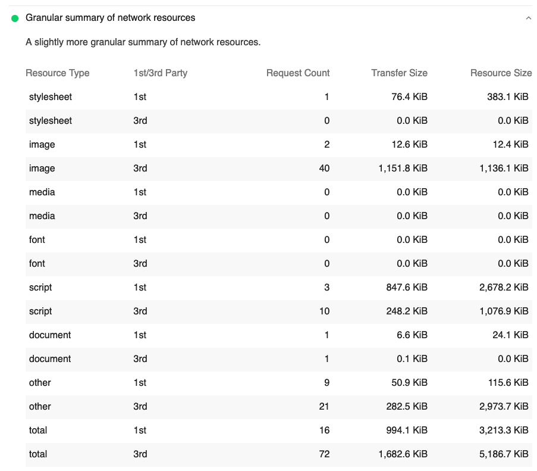

# lighthouse-plugin-resource-granular-summary

> A Lighthouse plugin to add slightly more granular summary of network resources



## Installation

```
$ yarn add -D lighthouse-plugin-resource-granular-summary
```

## Usage

```
$ lighthouse https://example.com --plugins=lighthouse-plugin-resource-granular-summary
```
